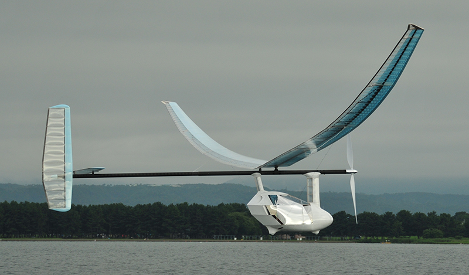
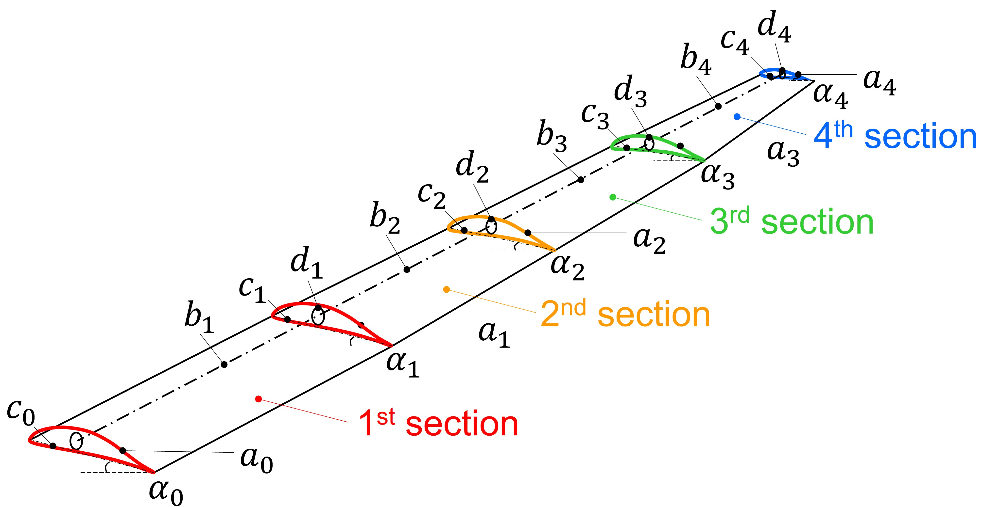

# Single and Multi-Objective Benchmark Problems Focusing on Human-Powered Aircraft Design

This repository provides the benchmark problems for single and multi-objective black-box optimization proposed in the following article. Please cite this article if you use these benchmark problems.

[Nobuo Namura, "Single and Multi-Objective Benchmark Problems Focusing on Human-Powered Aircraft Design", arXiv:2312.08953, 2023.](https://arxiv.org/abs/2312.08953)

## Requirements
Python 3.8.10 was used in the implementation.  
To install requirements:

```
pip install -r requirements.txt
```

>matplotlib >= 3.7.4<br>
>numpy >= 1.24.4<br>
>openpyxl >= 3.1.2<br>
>pandas >= 2.0.3<br>
>pymoo >= 0.6.1.1<br>
>scipy >= 1.10.1<br>

## Usage
### Unconstrained problems
Each problem is defined as a class object like HPA201 (see the following "Benchmark Problem Definition" for details about naming rules). Such unconstrained problems can be used as:  
```
from aircraft.problem import HPA201
import numpy as np

func = HPA201(n_div=4, level=0, NORMALIZED=True)
x = np.random.uniform(size=func.nx)
f = func(x)
```
* n_div: an integer (1,2,...) indicating the wing segmentation number ($n$ in the paper) and alters the problem's dimension, n_div=4 for default setting. 
* level: an integer (0,1,2) indicating the difficulty level of the problem ($l$ in the paper and following "Benchmark Problem Definition").
* NORMALIZED: a boolean indicating use of normalized design variables (True) or not (False)
* x: 1D numpy.ndarray of design variables
* f: 1D numpy.ndarray of objective functions

### Constrained problems
Constrained problems like HPA241 are used as:
```
from aircraft.problem import HPA241
import numpy as np

func = HPA241(n_div=4, level=0, NORMALIZED=True)
x = np.random.uniform(size=func.nx)
f, g = func(x)
```
* g: 1D numpy.ndarray of constraint functions to be less than or equal to 0

### Use with pymoo
Problems can also be used as "ElementwiseProblem" class in pymoo as:
 ```
from aircraft.adapter import PymooHPA
from pymoo.algorithms.soo.nonconvex.cmaes import CMAES
from pymoo.optimize import minimize

problem = PymooHPA(problem_name='HPA101', n_div=4, level=0, NORMALIZED=True)
algorithm = CMAES()
res = minimize(problem, algorithm, ('n_evals', 1000), seed=1, verbose=True)
print("Best solution found: \nX = %s\nF = %s" % (res.X, res.F))
```

### Visualization and output
The obtained solution can be visualized and saved into files as:
 ```
from aircraft.problem import HPA101

# "func = problem.hpa" can be used instead
func = HPA101(n_div=4, level=0, NORMALIZED=True)
x = res.X

# evaluate x just before the visualization and output
f = func(x)

# Wing shape and spanwise distribution of variables and functions
func.plot_wing_characteristics()

# Wing deflection at flight and parked conditions
func.plot_deflection()

# 3D-plot of deflected wings
func.plot_wing3d()

# Output design data as tables (csv)
func.save(path='./', DISTRIBUTION=True, PERFORMANCE=True, FIGURE=False)
```


## Human-Powered Aircraft (HPA)
HPA gain propulsion by the pilot pedaling like a bicycle to rotate a propeller. HPA typically have a wingspan of 20-35 [m], comparable to that of a passenger aircraft, yet their mass is only about 25-35 [kg]. They often feature wings made of foam and balsa wood, covered with heat-shrinkable film, and supported by carbon fiber reinforced plastic (CFRP) pipe frameworks. We focus on optimizing the main wing design of an HPA, including wing shape, lamination of CFRP pipe, dihedral angle at the wing root, wire tension, and payload. The wing segmentation number $n$ alters the problem's dimension. $n=4$ was used in the original paper, as illustrated in the following figures.

<p align="center">


</p>


## Benchmark Problem Definition
The benchmark problems are formulated as single or multi-objective minimization problems in the normalized design space:


$$
\begin{align*}
& \text{minimize}   & \quad & {\mathbf F({\mathbf x}_l)} = (f_1({\mathbf x}_l), \cdots, f_M({\mathbf x}_l)) \\
& \text{subject to} & \quad & {\mathbf G({\mathbf x}_l)} = (g_1({\mathbf x}_l), \cdots, g_N({\mathbf x}_l)) \leq 0 \\
&                   & \quad & {\mathbf x}_l \in [0, 1]^{D_l} \\
\end{align*}
$$

We classify problems as HPA $MNL$ − $l$, where $M$ is the number of objectives, $N$ is the number of constraints (excluding box constraints), $L$ is the problem index, and $l \in$ {0,1,2} is the difficulty level, which may be omitted if irrelevant. Higher $l$ indicates greater design variable freedom. 

The benchmark includes 60 problems (20 types $\times$ 3 levels) with 1-9 objectives. Original constrained problems (HPA \* $N$ \*) can also be used as unconstrained problems (HPA \* 0 \*) by means of a pre-implemented penalty method. The following table summarizes the design variable dimension $D_l$ at $n=4$ for each problem and difficulty level. Further details are in the original paper.

<p align="center">

| Problem      | $D_0$ | $D_1$ | $D_2$ |
|--------------|-------|-------|-------|
| HPA131, 101  | 17    | 32    | 108   |
| HPA142, 102  | 16    | 31    | 187   |
| HPA143, 103  | 18    | 33    | 189   |
| HPA241, 201  | 18    | 33    | 109   |
| HPA222, 202  | 16    | 31    | 187   |
| HPA233, 203  | 19    | 34    | 190   |
| HPA244, 204  | 18    | 33    | 189   |
| HPA245, 205  | 18    | 33    | 189   |
| HPA341, 301  | 18    | 33    | 109   |
| HPA322, 302  | 16    | 31    | 187   |
| HP333, A303  | 19    | 34    | 190   |
| HPA344, 304  | 18    | 33    | 189   |
| HPA345, 305  | 18    | 33    | 189   |
| HPA441, 401  | 18    | 33    | 189   |
| HPA422, 402  | 16    | 31    | 187   |
| HPA443, 403  | 18    | 33    | 189   |
| HPA541, 501  | 18    | 33    | 189   |
| HPA542, 502  | 19    | 34    | 190   |
| HPA641, 601  | 18    | 33    | 189   |
| HPA941, 901  | 19    | 34    | 190   |

</p>


## License
This project is under the BSD 3-Clause Clear License. See [LICENSE](LICENSE) for details.